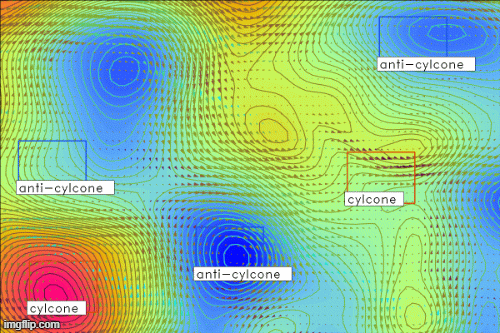

# TTK-4900-Master
TTK4900 - Engineering Cybernetics, Master's Thesis

## Report abstract

Predicting ocean dynamics using numerical models is challenging because of the unpredictable non-linearities and limited access to physical observations. Ocean eddies pose a complicated conceptual and practical challenges to theory and the models. Knowing the position and scale of mesoscale eddies can be used as a part of the observations in the assimilation process, improving the model's certainty and exactness. Due to the advantages such information, it was of interest to research novel machine learning methods to interpret data produced by models (e.g., SINMOD) or observed through remote measurements to recognize ocean features such as ocean eddies.

Because there is no "one fits all" machine learning (ML) algorithm, three of the most common supervised learning algorithms were evaluated: support vector machines (SVM), random forest, and Convolutional Neural Networks (CNN). Because the models need a sufficient amount of training samples, a data annotation application was created to generate a sufficient amount of training samples containing eddy features. The final training set included 2045 samples containing sea surface height, temperature, and ocean currents. After a smaller investigation of their ocean eddy predictability, an ensemble consisting of the ocean current vectors were found to provide much better performance without both sea surface height and temperature. In an initial trial of finding the best ML algorithm, CNN were found to be the best performing. The second trial examined three modified versions of the original CNN architectures: VGG, ResNet, and Inception. The best performing model was found to be a simplified modification of a VGG network structure. The final model could be used to detect multiple sliding windows on a selected grid of sea surface currents. The final predictions are merged using grouping techniques, which is further refined using well-established flow-field equations such as the Okubo-Weiss parameter and vorticity to provide more precise boundaries encapsulating the predictions.

The CNN model performed well when tested on a hold-out set of the training data, reaching accuracies above 96\%. The aggregated system of prediction and post-processing provided satisfactory results when tested on both SINMOD and other models and observational datasets. After analyzing the system's performance across the datasets, there were negligible similarities between the assimilated and observed ocean dynamics, although a year-long comparison seemed to find seemingly comparable trends in eddy activity due to bathymetry and the season.

## CNN 

### Predictions

Small sample of what the CNN is able to predict on a small grid (area consisting of about 3 degrees latitude and 8 degrees longitude somewhere between Norway and Greenland).  The sea surface level (ssl) shows the color contour plot, where higher sea levels has an increasing tone of red and lower levels are shown as blue. The velocity vectors are created by the plotting method "quiver", using eastward (zonal) ocean current velocity uvel and northrward (meridional) ocean current velocity vvel. All of these measurements are aggregated as channels in the 2d grid, just like RGB colors in a normal image, which is then used to train a "small" neural network with a very simple structure, as this is a research project and I only want to find out if it can find those simple and high level relationships between the features. A semi-automated MATLAB application (described in the next section) is used to extract data and annotations using [CMEMS](http://marine.copernicus.eu) global satellite measurements (0.063 degrees resolution). So far 1500 samples has been generated, with a ~95% test accuracy.

## SVM

Also tested SVM ~92% test accuracy.

## CMEMS satellite data compared to SINMOD model data

One of the goals of this project is to compare the appliance of Machine learning techniques on both CMEMS and SINMOD data and compare the results.

## Semi-automated training data generator

I've created a semi-automated way of extracting annotated data from CMEMS global satellite data. 

### What does the algorithm do?
**TMDI;dr:** Uses the Okubo-Weiss parameter to determine what is eddies or not. A GUI then showcases the eddies to an who validates the results. The eddies are resized to fit a standard frame size and stored as a compressed numpy array.

1. **For each day:** 
    1. Runs the OW-R2 algorithm that outputs the eddy census, i.e. how many eddies, center of eddie, diameter, etc,. The OW-R2 algorithm will be explained in a seperate section TBA. 
    1. It actually runs the algorithm twice, but with different boundaries on the OW parameter; such that it returns the areas absent eddies for images classified as non-eddy.
    1. **For each eddy found:**
        1. Use the centre of the eddy and its width (longitude) and height (latitude) to find a rectangular grid encompassing the eddy.
        1. Use a simple GUI to showcase the eddies for an expert, who can either tell the program that this is an eddy or not.
        1. Append another axis with the given classifcation.
        1. If it is an eddy, append it to the training data, if not discard it entirelly.
    1. After n amount of valid eddies are found, find n non-eddy features.
        1. It uses the average frame size of eddies (or the largest frame found for this day) to divide the whole grid of satellite data in to subgrids with this frame size.
        1. For each subgrid (an abundant amount of them) it discards the ones which has a cell with a cell masked as an eddy.
        1. From the remaining subgrids, it extracts n random subgrids to be used as non-eddies in the training set.
2. Resize (cv2.resize(interpolate)) the image to a standard fram size (or the largest/average frame found for all days).
3. Save dataset as a compressed numpy array.
  
### MATLAB GUI

One of the main concerns with the simple interface used for choosing training samples in python was that the algorithm only spits out the areas that has a very high likelihood of containing divergent flow. The Okuobu Weiss and R2 confidence level (how much the variation of dependent variables are explained by the independent variable of certain characteristics of the possible eddies compared to an ideal Gaussian eddy) spits out the same large eddies when found for grids seperated by only a few days. Although I had high hopes for the semi-automatic method, it does not provide a diverse enough pool of samples.

The GUI is a stand-alone application in MATLAB with variables and objects that are linked to the gui window. By one can use buttons to maneuver between datasets, i.e. the full grid, smaller windows (subgrids) of the full grid, and draw rectangles that holds the frame of a potential training data sample. There are four tabs showing different representations of the subgrid, one with both sea surface level (ssl) and ocean current velocity vectors, one that shows the phase angle of the ocean current, one for only the ocean current velocity, and the last one shows the ssl and vectors for the full grid. 

Whenever you have chosen a rectangle, it is displayed in a smaller figure in the upper right corner, which means you can analyze a smaller representation of the plot. Another thing that happens is that a popup window is shown, where you can decide wether the chosen frame has the label cyclone, anti-cyclone or nothing, or you can simply delete it. The rectangles deemed to be a training sample will stick around on the plot, with the color indicating its label; red for cyclone (high pressure area), blue for anti-cyclone (low pressure area), and simply black for the sampels labeled as "nothing".

The netcdf files has to be kept in "TBA". Before the application is run for the first time, the "set_config" has to be run to initiate application's internal counters for netcdf file (dataset) and what window you're on, such that you can simply exit the application, and continue where you dropped of the last time.
